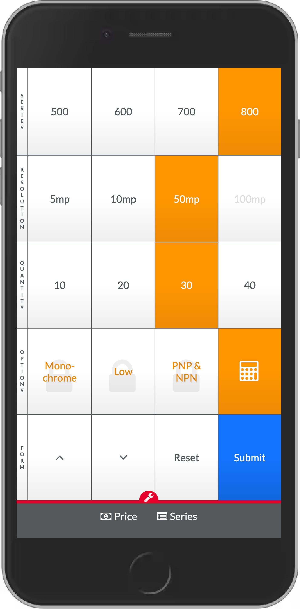

# Price Estimator

* **Try it out:** [http://wlotherington.com/price-estimator/](http://wlotherington.com/price-estimator/)
* **Stack:** Vaniall JS
* **Feedback:** [Will.Lotherington@hey.com](Will.Lotherington@hey.com)

### What is it?
Price estimator app for salespeople who have to determine ballbark pricing for complex systems with countless variations.

### Why?
Built in a past life before I knew anything about OOP. All real pricing and model information has been removed.